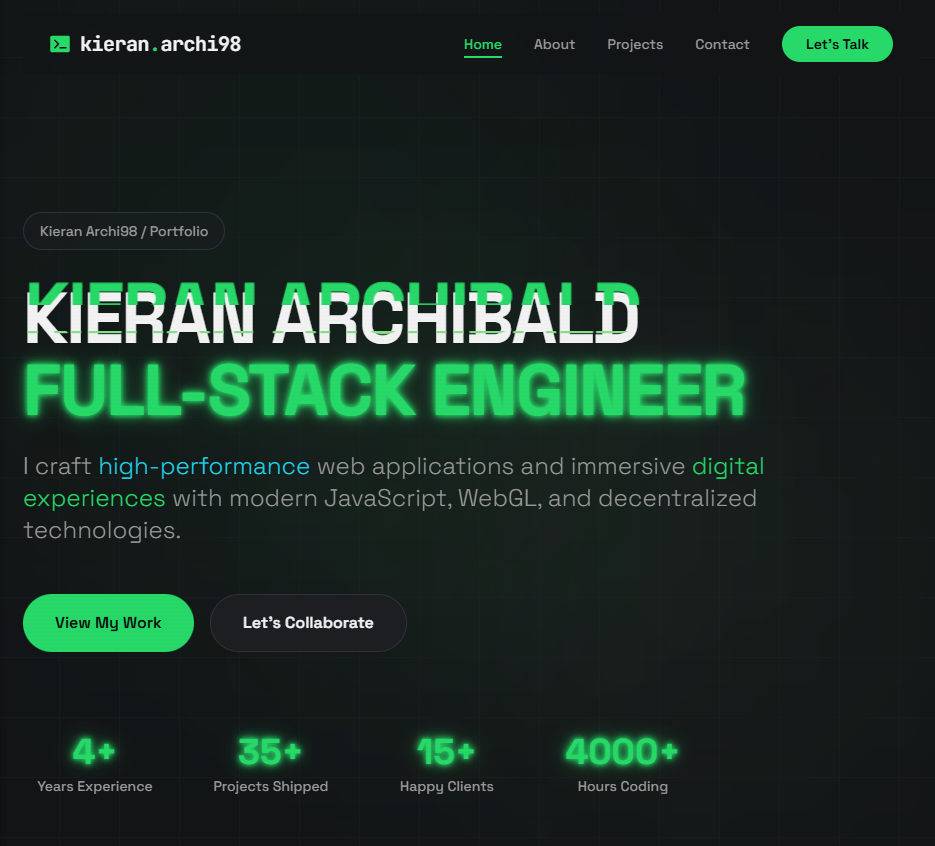
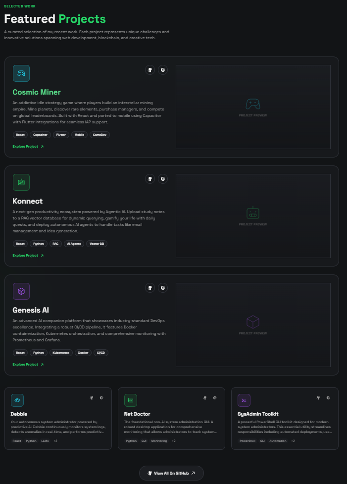
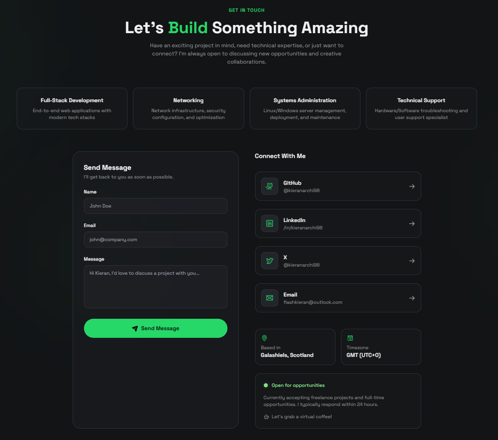

# Portfolio Website



A modern, responsive, and interactive portfolio website built to showcase my projects and skills as a Full Stack Developer and System Administrator.

This portfolio serves as a central hub for my professional identity, demonstrating my expertise in React, Python, and modern web technologies, as well as my background in system administration and DevOps.

## Features

*   **Interactive Hero Section**: Engaging introduction with dynamic animations using Framer Motion.
*   **About Me**: A comprehensive overview of my background, skills, and experience.
*   **Projects Showcase**: A detailed gallery of my work, including "Cosmic Miner", "Konnect", "Genesis AI", and more, with links to live demos and GitHub repositories.
*   **Responsive Design**: Fully optimized for all device sizes, from mobile phones to large desktop screens.
*   **Modern UI/UX**: Built with a focus on aesthetics and user experience, utilizing Shadcn UI and Tailwind CSS.
*   **Dark Mode**: Sleek and professional dark-themed design.
*   **Contact Form**: Easy way for potential employers or collaborators to get in touch.

## Screenshots

### About Section


### Projects Section


### Contact Section


## Tech Stack

*   **Frontend**: React, TypeScript, Vite
*   **Styling**: Tailwind CSS, Shadcn UI
*   **Animations**: Framer Motion
*   **Icons**: Phosphor Icons, Lucide React
*   **Routing**: React Router DOM

## Installation

To run this project locally, follow these steps:

1.  **Clone the repository:**
    ```bash
    git clone https://github.com/kieranarchi98/portfolio-attempt-2.git
    cd portfolio-attempt-2
    ```

2.  **Install dependencies:**
    ```bash
    npm install
    ```

3.  **Run the development server:**
    ```bash
    npm run dev
    ```

4.  **Open in browser:**
    Open [http://localhost:5173](http://localhost:5173) to view it in the browser.

## Building for Production

To create a production build:

```bash
npm run build
```

To preview the production build:

```bash
npm run preview
```
